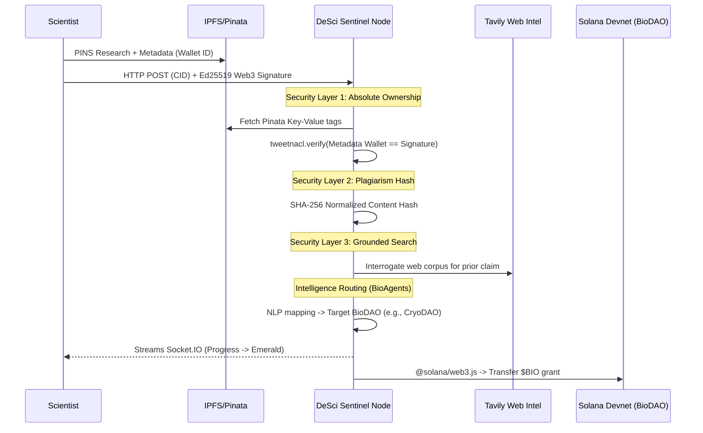

# 🧬 DeSci Sentinel — Autonomous DeSci Researcher (v3.0.0)

[](https://explorer.solana.com/?cluster=devnet)
[](#)
[](#)
[](https://bio.xyz)

**DeSci Sentinel** is a powerful, autonomous DeSci (Decentralized Science) research agent engineered deeply into the **Bio.xyz** ecosystem. Designed to bridge the gap between academic discovery and immediate liquidity, the platform automates peer-level research evaluation, multifaceted anti-plagiarism verification, and instant on-chain grant distribution.

As a registered **BioAgent**, DeSci Sentinel seamlessly connects scientific intellect with all 10 active **BioDAOs**.

---

## 🏛️ System Architecture & Engineering

The application is structured as a decoupled, real-time micro-monolith, leveraging WebSockets for constant client-agent synchronization during heavy heuristic evaluation.

### 🧬 Bio.xyz Tech Stack (Core Integration)
Our DeSci engine is heavily reliant on the **Bio Protocol** network to function as a true, aligned decentralized agent:
- **BioAgent Identity (`ai.bio.xyz`)**: DeSci Sentinel acts as a programmatic entity with specialized curation directives, exposing its alignment and health metrics directly via `/api/health`.
- **BioDAO Token Infrastructure**: Dynamically ingests SPL token registries via Bio.xyz configurations (`tokenlists.bio.xyz`), handling live symbol/decimal resolution on Solana Devnet.
- **BioDAO Heuristic Routing**: Evaluates and routes semantic claims strictly across the 10 active BioDAOs (e.g., *VitaDAO, HairDAO, CryoDAO, PsyDAO, CerebrumDAO, Curetopia, Quantum Biology DAO*).
- **Bio Launchpad APIs**: Aggregates live metadata and funding metrics directly aligned with the Bio.xyz Launchpad (`app.bio.xyz`).
- **$BIO SPL Grants**: Facilitates autonomous on-chain liquidity via the Bio Protocol's native `$BIO` devnet mint.

### ⚡ Broader Technology Stack
- **Frontend / Client Layer**: React 19, Vite 6, Tailwind CSS v4. UI animations leverage `framer-motion` and `lucide-react` for a highly engaging, transparent "Verification Stepper" experience.
- **Backend / Agent Layer**: Native Node.js with Express and TypeScript. Event-driven updates stream via `Socket.IO`. 
- **Blockchain Consensus**: Solana Web3.js (`@solana/web3.js`), SPL Token program. Cryptographic identity proofing utilizes `tweetnacl`.
- **Decentralized Storage**: IPFS pinning and retrieval natively handled via **Pinata**, utilizing custom key-value metadata to assert "Absolute Ownership."
- **AI Intelligence**: Integrates **Tavily AI Search API** for real-time web grounding to execute "Nobel-Theft" detection.

---

## 📽️ Agent Lifecycle Pipeline

DeSci Sentinel operates an immutable state machine, rejecting any payload failing to meet its strict security matrix:



---

## ✨ Enterprise Features (v3.0.0)

1. **Absolute Ownership (Ed25519 Validation)**  
   Guarantees the wallet signing the payload exactly matches the `author_wallet` key-value pair permanently pinned to the IPFS CID alongside the research. Zero "grant-snatching."

2. **Multifaceted Anti-Theft Protocol**  
   - **Internal Hash Table:** Prevents the same dataset from draining funds via SHA-256 fingerprints.
   - **Live Web Grounding:** Uses AI Search to definitively block submissions of already famous or journal-published material (e.g., rejecting *Attention Is All You Need*).

3. **Autonomous BioDAO Orchestration**  
   A specialized text evaluator scans abstracts for core themes (e.g., neurodegeneration, synthetic biology) and matches the payload directly to the funding pipelines of 10 BioDAOs, calculating an immutable "Trust Score."

---

## 🚀 Deployment & Operations

### 1. Zero-Config Environment
Ensure you have the following `.env` attributes in the backend (API keys optionally left blank for fallback mode):
```env
PINATA_JWT=your_pinata_jwt
TAVILY_API_KEY=your_tavily_key
BIO_AGENT_SECRET=your_solana_base58_private_key
```

### 2. Run the Full Stack
```bash
# Terminal 1: Spin up the BioAgent Node
cd desci-sentinel-backend
npm install && npm run dev 

# Terminal 2: Initialize Client
cd ../Frontend
npm install && npm run dev 
```

### 3. Pipeline Auditing
We ship with automated verification test suites designed to prove the structural integrity of the pipeline:
```bash
cd desci-sentinel-backend

# Test 1: Full Pipeline (Signature, Grounding, Red-Flags)
npx tsx src/scripts/backend_test.ts

# Test 2: BioDAO NLP Routing Integrity
npx tsx src/scripts/test_daos.ts
```

---

*Engineered by DeSci Pioneers. Fully aligned with [Bio Protocol](https://bio.xyz).*
